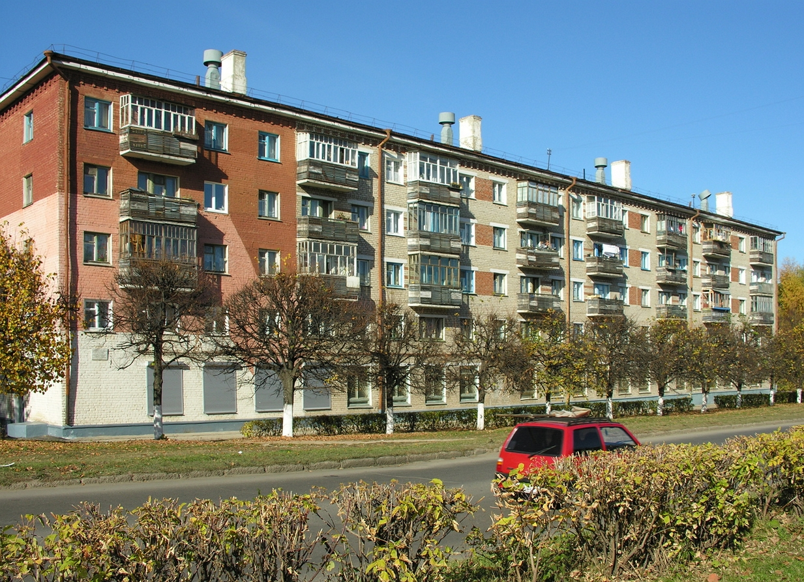

塔季扬娜是刘子超在阿拉木图留宿家庭里遇到的女房东。短短几页纸写满了我的新认知，也浓缩了他对哈萨克斯坦的印

有几个细节我真的很想说一下。

塔季扬娜的公寓位于阿拉木图南郊，窗外就是天山。对于我们城市动物来说，这不是人间仙境吗？想象一下，一个终南山，都能吸引这么多隐士。天山是多少网红们为了蹭流量，不得不去一睹雄伟壮观的打卡点啊？而且天山到处都是打卡点。

然而，草草一笔带过的文字，让我感觉对于塔季扬娜来说，她并不觉得什么，而且也不觉得这是一个卖点。她把一个房间出租是有别的原因。

文字里倒提到过公寓楼是赫鲁晓夫时代的遗产。我到好奇是什么样的风光。上网一搜居然找到，"赫鲁晓夫楼"。 

> 是一种造价低廉、盒子式或砌体结构三至五层的公寓楼，常见于俄罗斯、乌克兰等前苏联国家。苏联在20世纪60年代的尼基塔·赫鲁晓夫执政时期大量兴建了这类建筑，并以他的名字命名。

表面看来和中国的楼房区别不到，大家有兴趣继续搜一下，里面的设计和间隔都围绕着一个词"廉价"。

塔季扬娜，是俄罗斯人，当然，她的名字就是俄罗斯名。当然，阿拉木图的俄罗斯人混血的几率应该不小。她有俄罗斯、波兰、乌克兰的血统。想一想现在俄罗斯和乌克兰打仗打到你死我活，俄罗斯人还据说屠杀不少乌克兰人，但他们的爷爷奶奶们都是同宗而且通婚的。世界政治可以把亲人撕扯成敌人。

