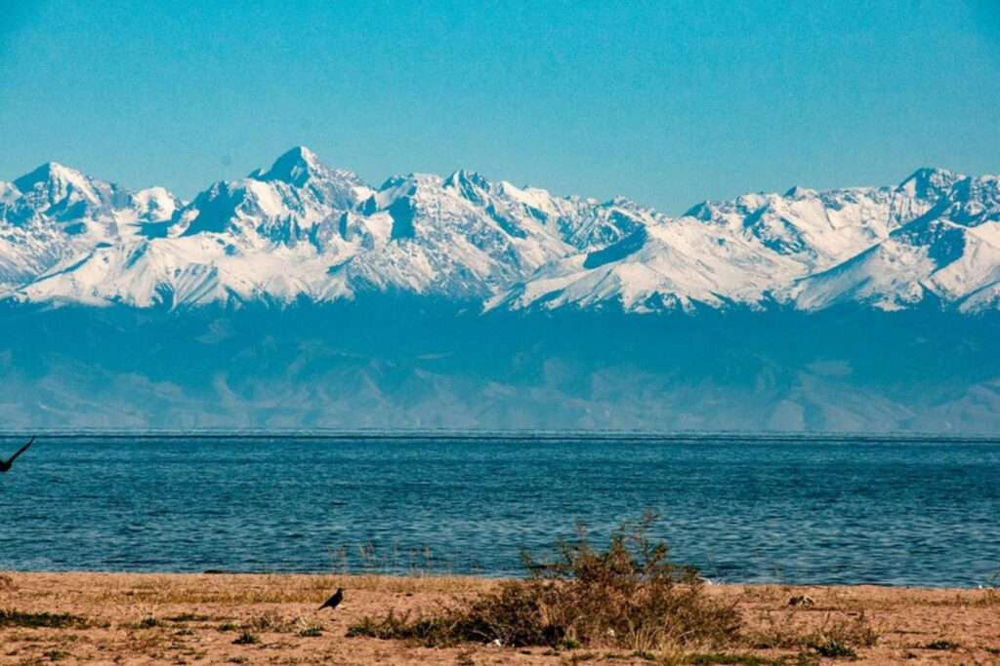

塔季扬娜是刘子超在阿拉木图留宿家庭里遇到的女房东。短短几页纸写满了我的新认知，也浓缩了他对哈萨克斯坦的印像。

有几个细节我真的很想说一下。

塔季扬娜的公寓位于阿拉木图南郊，窗外就是天山。对于我们城市动物来说，这不是人间仙境吗？想象一下，一个终南山，都能吸引这么多隐士。天山是多少网红们为了蹭流量，不得不去一睹雄伟壮观的打卡点啊？而且天山到处都是打卡点。

然而，草草一笔带过的文字，让我感觉对于塔季扬娜来说，她并不觉得什么，而且也不觉得这是一个卖点。她把一个房间出租是有别的原因。

文字里倒提到过公寓楼是赫鲁晓夫时代的遗产。我到好奇是长成什么样子。上网一搜居然找到，"赫鲁晓夫楼"。 

> 是一种造价低廉、盒子式或砌体结构三至五层的公寓楼，常见于俄罗斯、乌克兰等前苏联国家。苏联在20世纪60年代的尼基塔·赫鲁晓夫执政时期大量兴建了这类建筑，并以他的名字命名。

表面看来和中国的楼房区别不到，大家有兴趣继续搜一下，里面的设计和间隔都围绕着一个词"廉价"。

塔季扬娜，是俄罗斯人，当然，她的名字就是俄罗斯女性名字。然而，在阿拉木图出生的俄罗斯人，混血的几率应该不小。她有俄罗斯、波兰、乌克兰的血统。想一想现在俄罗斯和乌克兰打仗打到你死我活，俄罗斯人还据说屠杀不少乌克兰人，但他们的爷爷奶奶们都是同宗而且通婚的。世界政治可以把亲人撕扯成敌人。（在中亚这个地方，到处都是政治权利冲突后留下的后遗症。从赫鲁晓夫楼到老一代家庭的伤疤和新一代年轻人的祈愿。）

塔季扬娜在俄罗斯完成学业，回到阿拉木图从事矿业勘探，她有过两段婚姻。"第一任丈夫是俄罗斯人，喜欢喝酒，"（大家也能猜到离婚的很大原因可能就是酒精。伏特加在俄罗斯地位在我看来有点像是咖啡在西方社会的地位，茶叶在亚洲的地位。不过酒精毕竟更加危险）

第二任丈夫是鞑靼人，现实新闻记者，后来晋升为哈萨克宣传部的官员，“凭借丈夫的资历，他们分到了这套公寓。不过几年后，鞑靼丈夫另觅新欢，成立了新的家庭。”

结果塔季扬娜中年一个人，她并没有什么不良嗜好，不抽烟不喝酒，晚饭下馆子，牵着狗散步，平平淡淡地生活着。当然，刘子超的到访和接下来的旅程，还是给她带来了一点惊喜。

刘子超想去天山-阿拉套国家公园，从阿拉木图驱车半小时的山脉。然而，如此近的地方，塔季扬娜已经快十年没有过去了。外人觉得惊艳地景致，看久了也是如此。生命是在一直寻找新意，还是应该继续墨守着过往的平淡的日子呢？塔季扬娜显然对再次踏足这片国家公园很有兴趣，决定和作者一直走。

读到这里，我也忍不住打开Google地图，在上面搜寻者，跟上作者和女主人角度浏览一番，我研究了一下地图的行程，他们应该就是沿着这条公路线走。这条路线从总统公园到阿拉木图湖。（[Google地图地路线](https://maps.app.goo.gl/Vt4r8PgaDhZfcSGdA)）

从Google的卫星图上，我们就可以看到沿着公路进山，不久就能爬升到接近常年雪线到海拔高度。短短到路程，就从阿拉木图的1200米地海拔，提升到2500米左右的阿拉木图湖。这也来到了第一个打卡点，阿拉木图湖。“我们抵达山间的一片丘陵。在一块巨大的碗状岩石上，绿松石色的大阿拉木图湖出现在眼前。湖水被山峦环绕，有一种高原湖泊所特有的静谧。”

绿松石色是什么颜色？看图吧。

更多的图片可以自己再搜一下吧。关于这个打卡点，[这是TripAdvisor的链接](https://www.tripadvisor.com.au/Attraction_Review-g298251-d2211137-Reviews-Big_Almaty_Lake-Almaty.html)。简单阅读了一些评论，看得出那里风景是很美，但是，也十分坑人。当地人就是靠这个美景来吊游客。没办法，就是这样了。

说起湖泊，塔季扬娜说，放过这些山脉就会到[伊塞克湖](https://maps.app.goo.gl/5mpykpg2ZiSfgGaZ9)。根据维基百科介绍，伊塞克湖在中国汉代称其为阗池，唐代称之为热海、大清池，清代称为特穆尔图淖尔、图斯池。在《大唐西域记》里，玄奘这样记载。
> 山行四百余里至大清池。周千余里，东西长，南北狭，四面负山，众流交凑，色带青黑，味兼咸苦。洪涛浩汗，惊波汩㴔，龙鱼杂处，灵怪间起。所以往来行旅，祷以祈福，水族虽多，莫敢渔捕。

这样的描写放到今天有卫星拍照和测量的高科技年代，也确实十分准确。这是世界上容量最大的咸水湖，除了里海之外。这个一个高山环绕的天然大湖，湖面的海拔1600米左右，然而围着他的天山，海拔可达4000-5000米。以我看来，这不是一个盆，是一个桶了。

在湖面那个角度看过去，都是一堵天山连成的墙。

这样的景观真的绝无仅有。

塔季扬娜不得不提这个大湖，因为，对比眼前的阿拉木图湖——一个人工水坝储水而成的高山湖泊。伊塞克湖是如此浩瀚无垠，伟大而壮观，感谢造物主的恩赐，这个大湖滋润了这里的生命和一代代的文明。

塔季扬娜：“小儿子六岁时，他的父亲就带着他，从阿拉木图徒步去伊塞克湖。有三个晚上要在山里过夜。​”她回忆着往事。可惜的是，​“苏联解体后，这样的旅行已经不可能了。​” 是的，现在阿拉木图属于哈萨克斯坦，伊塞克湖则属于吉尔吉斯斯坦。海拔4，5千米高的天山阻挡不了人来到这个人间仙境，而人思想里的那条看不到的界限却成了真实而不能通过的铁幕。

而正如《我不是废柴》书里，沈磊说过的一句，人间仙境里唯一的败笔就是人。而在作者的笔下，这里的风景绝美和人性丑陋形成了鲜明的对比。

绕过阿拉木图湖，沿着山路继续前进，途经一座苏联时期的[天文台](https://maps.app.goo.gl/wMjPByXwrwNfrZvL9)。

然后遇上边防哨所（我猜这也是苏联解体后才设有的）。他们检查了证件，经过交涉，允许通过下一个隘口到位于天文台西南六公里处的[科研站](https://maps.app.goo.gl/PcZ2BzDAyq5d6pJ68)。

这里除了起伏连绵的山峦，还有终年积雪的冰川。你眼力所及的可能是海拔不到2000米的堰塞湖，草甸，又可能是高拔如云，4000-5000米的雪峰。 身在此中，你也许会暂时忘却所有的烦恼，又或者会重新思考自己的人生意义。来这里一次不容易，对我来说甚至是不可能，如果没有Google的话，我根本无法一睹这样的风光。然而，这样的旅行和这样的目睹，能带给我们怎样的体验和思考呢？旅游的意义又是什么呢？

